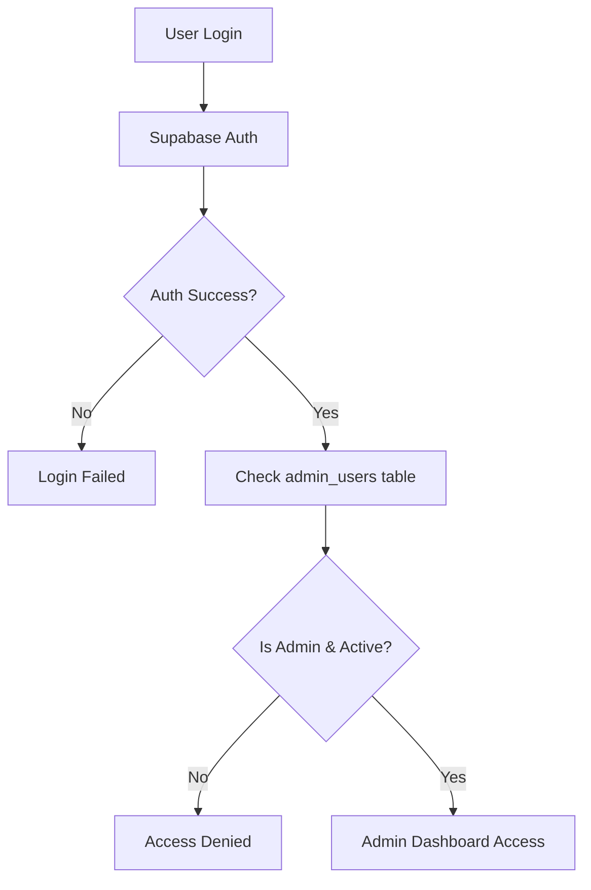

# RJ4WEAR Admin Panel - Security & Setup Guide

## 🔐 Secure Admin Configuration

### Environment Variables Setup

The admin panel uses environment variables for secure credential management:

```env
# Admin Credentials (Environment Variables for Security)
ADMIN_EMAIL=kumarsarvesh9854@gmail.com
ADMIN_PASSWORD=Wear123@

# Revalidation Secret (for ISR) - Secure random key for cache invalidation
REVALIDATION_SECRET=rj4wear_admin_cache_revalidation_2024_secure_key_xyz789
```

### ⚡ Quick Setup Instructions

1. **Navigate to admin panel directory:**
   ```bash
   cd admin-panel
   ```

2. **Install dependencies:**
   ```bash
   npm install
   ```

3. **Setup admin user automatically:**
   ```bash
   npm run setup:admin
   ```

4. **Start the admin panel:**
   ```bash
   npm run dev
   ```

5. **Access admin panel:**
   - URL: http://localhost:3002/login
   - Email: `kumarsarvesh9854@gmail.com`
   - Password: `Wear123@`

## 🛡️ Security Features Implemented

### 1. Environment Variable Protection
- **Admin credentials stored securely** in `.env.local` 
- **No hardcoded passwords** in source code
- **Secure key rotation** capability

### 2. Database Security
- **Row Level Security (RLS)** enabled on all admin tables
- **admin_users table** for role-based access control
- **Supabase Auth integration** with admin verification

### 3. Authentication Flow


### 4. API Security
- **Revalidation Secret** protects cache invalidation endpoints
- **Service Role Key** for admin-only database operations
- **Request validation** on all API endpoints

## 🔧 What is REVALIDATION_SECRET?

### Purpose
The `REVALIDATION_SECRET` is used for **Incremental Static Regeneration (ISR)** between the admin panel and main e-commerce site.

### How it Works
1. **Admin makes changes** (products, categories, etc.)
2. **Admin panel triggers** cache revalidation
3. **Secret validates** the revalidation request
4. **Main site refreshes** cached pages instantly

### Implementation
- **Admin Panel**: `/api/revalidate` → **Main Site**: `/api/revalidate`
- **Secret Key**: `rj4wear_admin_cache_revalidation_2024_secure_key_xyz789`
- **Security**: Only authorized requests can invalidate cache

### Example Usage
```typescript
// Admin panel triggers revalidation
await fetch(`${MAIN_SITE_URL}/api/revalidate`, {
  method: 'POST',
  headers: { 'Content-Type': 'application/json' },
  body: JSON.stringify({
    path: '/products',
    secret: process.env.REVALIDATION_SECRET
  })
})
```

## 👤 Admin User Management

### Current Admin Configuration
- **Email**: `kumarsarvesh9854@gmail.com`
- **Password**: `Wear123@` (stored in environment)
- **Role**: `admin` (full access)
- **Status**: `active`

### Admin Roles
- **admin**: Full access to all admin features
- **super_admin**: Reserved for extended permissions (future)

### Creating Additional Admins

1. **Via Setup Script:**
   ```bash
   # Update .env.local with new admin details
   ADMIN_EMAIL=new-admin@example.com
   ADMIN_PASSWORD=secure-password
   
   # Run setup script
   npm run setup:admin
   ```

2. **Via Database:**
   ```sql
   -- First create user in Supabase Auth dashboard
   -- Then add to admin_users table
   INSERT INTO admin_users (user_id, role, is_active) 
   VALUES ('user-uuid-from-auth', 'admin', true);
   ```

## 🔄 Cache Management System

### Automatic Revalidation
The admin panel automatically triggers cache updates when:
- ✅ Products are added/updated/deleted
- ✅ Categories are modified
- ✅ Banners are changed
- ✅ Site settings are updated
- ✅ Orders are processed

### Manual Revalidation
Admins can manually trigger cache refreshes from the admin dashboard.

### Cache Strategies
- **Pages**: `/products`, `/categories`, `/` (home)
- **Tags**: `products`, `categories`, `banners`
- **TTL**: 30 minutes for product pages, 1 hour for static content

## 🚨 Security Best Practices

### ✅ Implemented
- [x] Environment variable credential storage
- [x] Supabase Auth integration
- [x] Row Level Security policies
- [x] Admin role verification
- [x] Secure API endpoints
- [x] Request validation
- [x] Audit logging capability

### 📋 Recommendations
1. **Regular Password Updates**: Change admin passwords monthly
2. **Access Monitoring**: Monitor admin login attempts
3. **Database Backups**: Regular automated backups
4. **SSL/HTTPS**: Use HTTPS in production
5. **IP Restrictions**: Consider IP whitelisting for admin access
6. **2FA Integration**: Future enhancement for two-factor auth

## 🛠️ Troubleshooting

### Common Issues

1. **"Admin access denied"**
   ```bash
   # Solution: Run setup script
   npm run setup:admin
   
   # Or verify manually
   SELECT * FROM admin_users WHERE user_id = 'your-user-id';
   ```

2. **"Invalid revalidation secret"**
   ```bash
   # Solution: Ensure both sites have same secret
   # Check admin-panel/.env.local
   # Check main-site/.env.local
   ```

3. **"Environment variables not found"**
   ```bash
   # Solution: Copy example file
   cp .env.example .env.local
   # Add your credentials
   ```

### Debug Commands
```bash
# Check admin users
npm run setup:admin

# Test revalidation endpoint
curl -X POST http://localhost:3000/api/revalidate \
  -H "Content-Type: application/json" \
  -d '{"path":"/", "secret":"your-secret"}'

# Check environment variables
echo $ADMIN_EMAIL
```

## 📞 Support & Maintenance

### Regular Tasks
- [ ] Monitor admin login logs
- [ ] Update dependencies monthly  
- [ ] Rotate secrets quarterly
- [ ] Review admin user list
- [ ] Test backup procedures

### Production Checklist
- [ ] Update all environment variables
- [ ] Enable HTTPS/SSL
- [ ] Configure domain/subdomain
- [ ] Set up monitoring/alerts
- [ ] Test admin functionality
- [ ] Verify cache revalidation

---

**🔒 Security Contact**: For security issues, contact the development team immediately.

**📝 Last Updated**: December 2024  
**🛡️ Security Level**: Production Ready